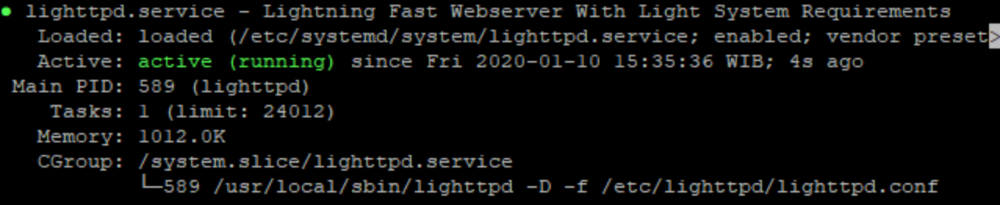

# openstack-pihole-automated-install
Bash scripts to automate the install of PiHole on an Openstack CentOS 8 Cloud Image

Need to get a Minimal CentOS 8 Cloud Image instance installed and running on your openstack server and this will not be covered here as there are several tutorials to get this accomplished

Log into the CentOS image you created and get to a command prompt

Install Git:
```
sudo dnf install git
```

Clone the scripts from the Git Repo repo: 
```
sudo git clone https://github.com/seadogger/openstack-pihole-automated-install.git
```

Change into the script directory, set script as executable, and run script:
```
cd openstack-pihole-automated-install
sudo chmod 755 pihole-basic-install.sh
sudo ./pihole-basic-install.sh
```

You will have to continue once through the script by pressing the "q" key.  Before hitting the "q" key however verify the lighttp service is up and running correctly



When the scripts completes you will prompted through several PiHole installation menus.  You can accept all the default settings and have a working PiHole installation however you can tailor the installation for your own needs as well (e.g. DNS server).

At the end of the installation make sure to record the default password that was created during the installation so you can log into the PiHole Admin console.  Installation is finished and you can now use the PiHole admin console to configuration block lists and configure unique parameters of your installation.

Don't forget to change your router to point to the PiHole IP address as the primary DNS server.

This script was developed from the information in this [article](https://rootdicalism.wordpress.com/2020/01/24/pi-hole-installation-on-centos-8-part-3/) and tailored for an Openstack Cloud Image


